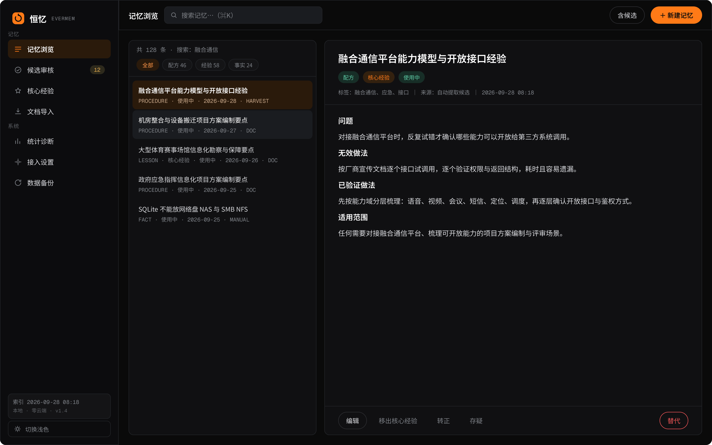
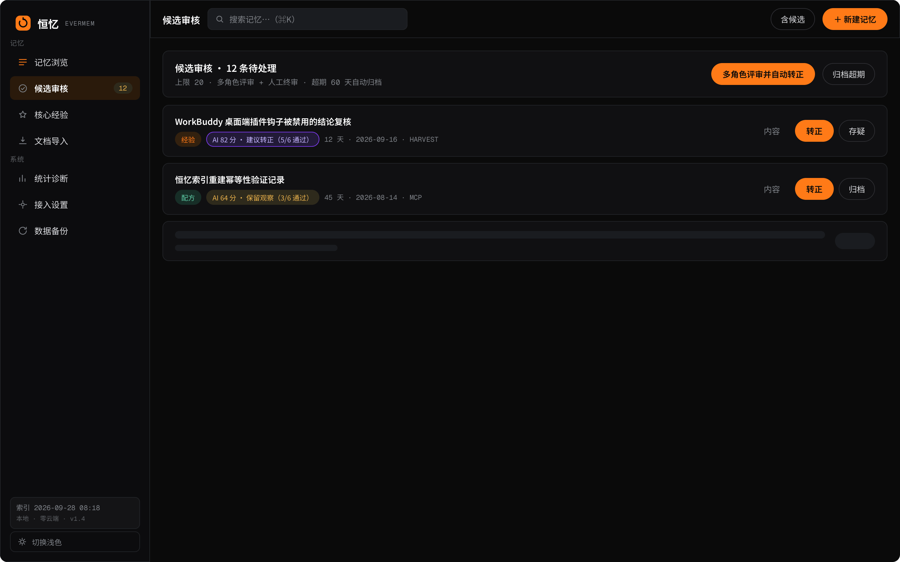
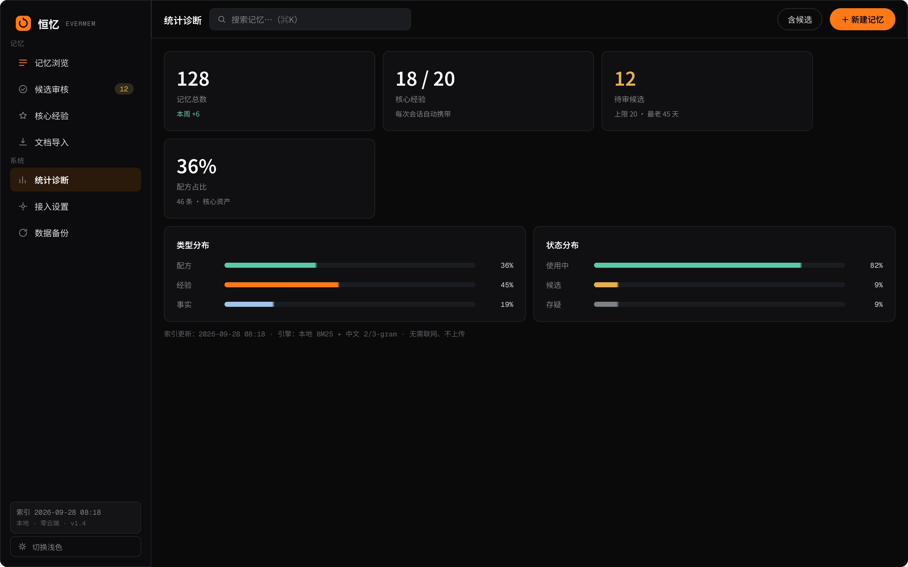
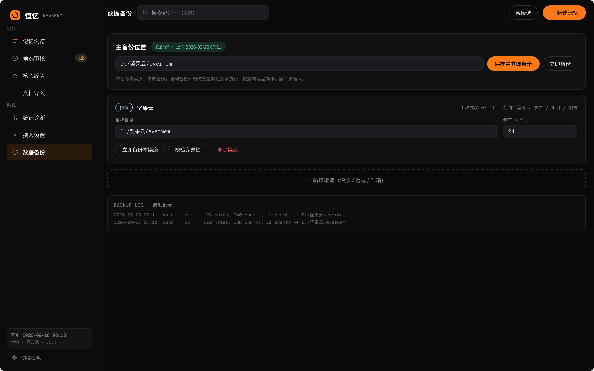
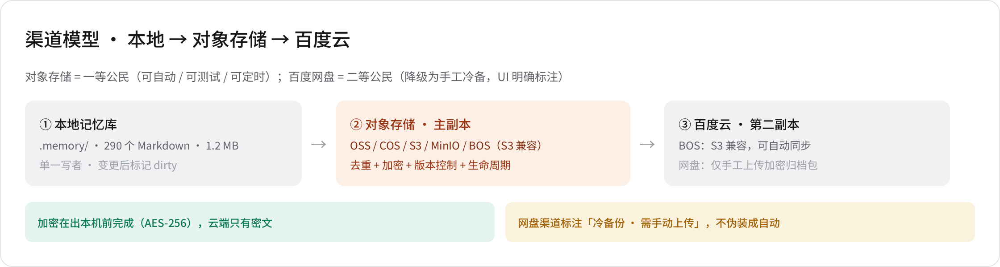
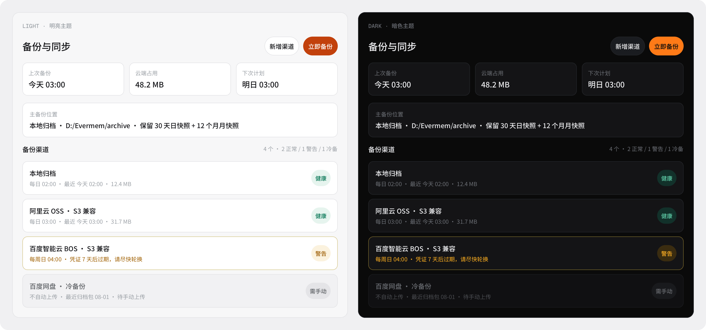
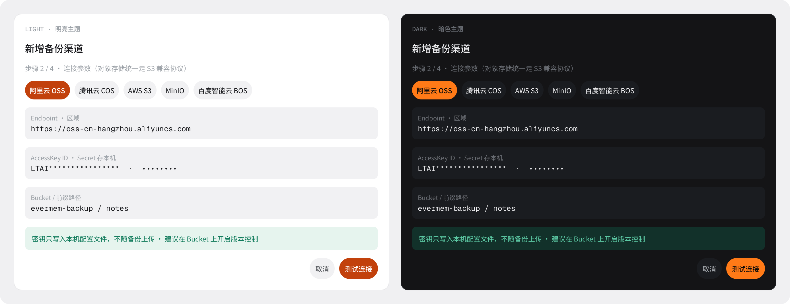
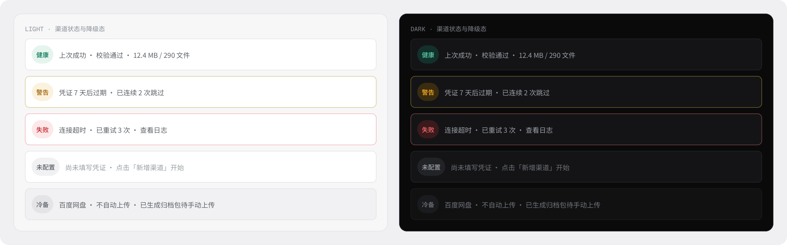

<h1 align="center">Evermem (pmem)</h1>

<p align="center"><em>A personal cross-session experience memory system — distill the trial-and-error from AI conversations into reusable local knowledge, so the next session reuses verified conclusions instead of starting from scratch.</em></p>

<p align="center">
  
  
  
  
  
</p>

<p align="center"><b>Zero-dependency · Fully local · No cloud.</b><br><a href="README.md">中文文档</a></p>

---

## Table of Contents

<p align="center">
  <a href="#introduction">Introduction</a> ·
  <a href="#features">Features</a> ·
  <a href="#directory-layout">Layout</a> ·
  <a href="#ui-preview--system-diagram">UI Preview</a> ·
  <a href="#quick-start">Quick Start</a> ·
  <a href="#usage">Usage</a> ·
  <a href="#architecture">Architecture</a> ·
  <a href="#configuration">Configuration</a> ·
  <a href="#privacy--security">Privacy</a> ·
  <a href="#documentation">Docs</a> ·
  <a href="#contributing">Contributing</a> ·
  <a href="#license">License</a>
</p>

---

## Introduction

Evermem (pmem) is a **personal cross-session experience memory system**. It reads the on-disk session transcripts of AI hosts (WorkBuddy / DSH / Claude Code, etc.) directly — **without any hooks or plugin channels** — and automatically captures the *trial-and-error process* of each conversation: failed commands, wrong assumptions, and finally-verified solutions. These are distilled into structured local notes. On the next session, this experience is automatically retrieved and injected into context, letting the AI reuse proven conclusions instead of guessing again.

**Core principles**:

- Notes are local Markdown (the single source of truth); indexes are rebuildable at any time.
- Data and code are separated: **memory data never enters Git**, it is only backed up through encrypted channels.
- Automatic extraction never goes straight into the official store: candidates must pass multi-role review or manual final review.

## Features

| Capability | Description |
| --- | --- |
| 🪝 **Hook-free auto capture** | `harvest.py` scans host session transcripts, pairs tool calls with results, and detects "failure / retry / failure-then-success" patterns |
| 🔗 **Dual-channel harvesting** | **Command-level**: command-signature fragments (success recipes / failure lessons); **Task-level**: detects complete "multiple failures → final success" task chains and produces experience candidates with task intent and final solution |
| 🧑⚖️ **Multi-role review with auto disposition** | Six roles score independently (Quality / Tech / Compliance / Value / Novelty / Ops) → weighted consensus → graded disposition: high-score promoted, low-quality/duplicate archived, **sensitive/dangerous vetoes always kept for human review** |
| 🔒 **Security first** | The Compliance role detects sensitive patterns (classified info, IDs, tokens); the Tech role detects dangerous commands (`rm -rf`, etc.); vetoed candidates are never auto-archived to hide risk — they stay for human handling |
| 🧠 **Ready-to-use retrieval** | BM25 + Chinese 2/3-gram token matching; three tiers (Hot layer resident / Warm layer recall / Cold layer tracing) so the most valuable experience bypasses retrieval and enters context directly |
| 📥 **Data import (two sources)** | Document import: split docx/xlsx/pdf into chunks for AI distillation; External memory import: profile-export format, Markdown, JSON, or a whole directory — deduplicated and landed as `staged` |
| 🖥️ **Full web UI** | Zero-dependency HTTP service (Python stdlib): 7 views including memory browsing, candidate review, data import, stats, and data backup; light/dark themes as peers, Chinese/English switching |
| 💾 **Multi-channel backup & sync** | Object storage (S3-compatible: Alibaba OSS / Tencent COS / AWS / MinIO / Baidu BOS), SMTP mail, local mirror, full snapshots, Baidu Netdisk cold backup; incremental sync + encrypted archives + failure alerting |
| 🌍 **Cross-platform, zero dependency** | Pure Python standard library; runs on Windows / macOS / Linux |

## Directory Layout

```
.
├── README.md (ZH, default) / README.en.md (EN)   # Project docs (Chinese default)
├── CHANGELOG.md / LICENSE / VERSION / .gitignore
├── mem.py            # CLI engine: recall / add / show / gc / hot / candidates / reindex / stats
├── memimport.py      # External memory import engine (profile / Markdown / JSON / dir, content-hash dedupe)
├── harvest.py        # Session harvesting: command-level + task-level candidates
├── evermem_mcp.py    # MCP server (retrieve / store / update / hot-sync)
├── backup.py / s3client.py   # Multi-channel backup (object storage / SMTP / snapshot-encrypted)
├── app.py            # Desktop GUI (PySide6, window-resize adaptive)
├── web/              # Zero-dependency web UI (run web/server.py, bundled frontend assets)
├── scripts/          # Dev & ops tools (batch-read / benchmarks / self-check / space & knowledge scan / hot preview)
├── templates/        # Skill & prompt templates (single source of truth)
├── tests/            # Regression tests
└── docs/             # Architecture / backup / audit / platform docs
```

## UI Preview · System Diagram

Core UI designs cover **main views → backup & sync module**, 8 screens in total, ordered by system module. The UI is a built-in zero-dependency web app (`python web/server.py`), and **every design has been implemented in code** with light/dark themes as peers.

### 01 · Memory Browse · Desktop

> The main screen: sidebar navigation (8 views), memory search list, tag / type / status filters and pagination.



### 02 · Candidate Review · Desktop

> The review workbench for auto-harvested candidates: AI multi-role score badges, body viewer, the "multi-role review & auto disposition" entry, and promote / mark-suspect / archive actions.



### 03 · Stats & Diagnosis · Desktop

> System health overview: note type/status distribution, retrieval usage stats, harvest and index diagnostics.



### 04 · Data Backup · Desktop

> The backup & sync entry: channel list with status badges, run backup / restore, and log viewer.



### 05 · System Architecture: Local → Object Storage → Baidu Cloud

> Data lifecycle overview: local is the single source of truth, uploaded **one-way and encrypted** through multiple channels to object storage (hot replica, auto-scheduled) and Baidu Cloud (cold backup, manual upload).



### 06 · Backup & Sync · Main View (Light / Dark)

> Overview stat cards, primary backup location, channel list with live status badges; light/dark themes as peers.



### 07 · Add Channel · Wizard (Light / Dark)

> A four-step wizard: choose channel type → connection parameters (S3-compatible protocol, with built-in presets for major clouds) → encryption & policy → confirm & save; connection testing and password-strength checks are built in.



### 08 · Channel Status Matrix (Light / Dark)

> Channel health at a glance: healthy / warning / failed / not configured / cold backup — status derived from a single source of truth.



## Quick Start

### Requirements

- Python 3.10+ (standard library only, no third-party dependencies)
- Windows / macOS / Linux

### 1. Launch the Web UI (recommended)

```bash
cd web
python server.py          # default port 8765
# open http://127.0.0.1:8765
```

### 2. Use the CLI

```bash
export PMEM_HOME="/path/to/your/data"   # Windows: set PMEM_HOME=...
python mem.py recall "query terms"       # retrieve memories
python mem.py add --type procedure --title "..." --body "..." --tags a,b   # distill experience
python harvest.py scan --days 7 --dry-run   # preview harvesting (drop --dry-run when confirmed)
python mem.py hot --apply          # sync hot layer to the host's must-read file
```

> When `PMEM_HOME` is unset, the data directory defaults to the script directory; all paths go through pathlib and no absolute paths are hardcoded in the code.

## Usage

### Three command pipelines

| Goal | Command |
| --- | --- |
| Recall memory | `mem.py recall "query" [--limit 5] [--all]` |
| Store memory | Write Markdown to `notes/<type>s/`, then `mem.py reindex` |
| Auto-harvest candidates | `harvest.py scan --days 7 --dry-run`, drop `--dry-run` when confirmed |
| Import external memory | `memimport.py preview --file profile.md` → `memimport.py import --file profile.md` |
| Sync hot layer | `mem.py hot --apply --target <project>/.workbuddy/memory/MEMORY.md` |
| Retention check | `mem.py gc` (read-only); `--apply` runs it, `--prune` also deletes originals |
| Export usage profile | `mem.py profile --limit 5 [--out profile.md]` |
| Self-check | `tests/test_recall.py`, `scripts/frontend_smoke.py`, `scripts/check_all.py` |

### Data import (one menu module, two sub-modules)

| Sub-module | Purpose | Output |
| --- | --- | --- |
| **Document import** | Split docx / xlsx / pdf / pptx into chunks | Text chunks in the chunk store, ready for AI distillation |
| **External memory import** | Bring memories exported from other tools | Landed as notes (default `staged`) |

**External memory import is two steps, in this order:**

1. **① Export-memory prompt** — the page shows a ready-to-copy prompt (single source of truth:
   the `COPY:BEGIN/END` region of `templates/usage-profile.prompt.md`; edit the template to change it).
   Paste it into a new session of any AI tool so it produces your usage profile across
   *instructions / identity / career / projects / preferences*.
2. **② Paste & import** — paste the profile back into the box below, parse it, tick the entries, import.

Accepts four inputs, with auto format detection:

```bash
python memimport.py preview --text "## Preference
[2026-09-27] - Lead with the conclusion, then the evidence"   # ① profile export format
python memimport.py preview --file export.json                 # ② JSON (items/notes/memories)
python memimport.py preview --file note.md                     # ③ Markdown (with or without frontmatter)
python memimport.py import  --dir "F:/another-vault/notes"     # ④ whole directory of .md/.json
```

The preview marks every entry as **importable / possible duplicate / already exists** (content-hash
dedupe makes repeated imports idempotent) and pre-selects only the importable ones. Confirmed entries
are written to the official notes directory with **`status: staged`** — excluded from recall until you
promote them one by one in Memory Browse. Import is read-only against the source.

### Candidate review flow

1. `harvest.py scan` auto-harvests → candidates land in `notes/candidates/` (`status: staged`);
2. In the Web "Candidate Review" view, run **multi-role review & auto disposition**: high scores promoted, duplicates/low-quality archived, kept for observation, **sensitive/dangerous kept for human review**;
3. Manual final review: inspect each item, then promote / mark suspect / archive;
4. After `mem.py reindex`, official notes enter the retrieval pool.

### Backup & sync

```bash
python backup.py status            # view channel status
python backup.py --dry-run         # preview what will be synced
python backup.py                   # run incremental sync
python backup.py --restore         # restore from a channel
```

See [docs/BACKUP-DESIGN.md](docs/BACKUP-DESIGN.md) for details.

## Architecture

### Three tiers, ordered by certainty of use

| Tier | Content | How it takes effect |
| --- | --- | --- |
| **Hot** | ≤20 notes manually marked `hot: true` | Synced into the host's must-read file; resident from session start, **retrieval-independent** |
| **Warm** | All notes | `recall` retrieval, triggered by skill reminders |
| **Cold** | `events/*.jsonl` evidence | Append-only; used for tracing and falsification |

### Data flow

```
AI session transcript JSONL
   ↓ harvest.py (no hooks)
Candidate pool notes/candidates/ (staged)
   ↓ Multi-role review (six roles) · auto disposition
Promoted(active) / kept / archived / kept-for-human (sensitive/dangerous)
   ↓ mem.py reindex
Official notes (notes/<type>s/) → retrieval pool / hot layer / backup
```

### Dual-track separation

- **Code** → Git repository (GitHub private repo `linhut/evermem`), including platform docs;
- **Data** (notes / events / index / config) → never enters Git; backed up encrypted via `backup.py` to object storage / mail / local mirror / cloud cold backup.

## Configuration

### Environment variables

| Variable | Description | Default |
| --- | --- | --- |
| `PMEM_HOME` | Data directory (code/data fully separated) | script directory |
| `PMEM_WEB_PORT` | Web server port | 8765 |
| `PMEM_AUTO_HARVEST_SECONDS` | Auto-harvest interval | 3600 |
| `PMEM_NO_AUTO_HARVEST` | Set to `1` to disable the auto-harvest thread | enabled |

### Backup channels (`pmem_backup.json`)

- Channel types: `local` (incremental mirror) / `archive` (full snapshot, keep N) / `remote` (ssh/scp) / `mail` (SMTP attachment) / `s3` (object storage) / `baidu-pan` (cloud cold backup)
- Object storage credentials and the **archive encryption password** are configuration items (filled in via the Web wizard); **no secrets are hardcoded in the code**;
- Archive packages are encrypted with AES-256-CBC (openssl pbkdf2, 200k iterations) before leaving the machine; plaintext keys are never persisted.

## Privacy & Security

- **Data never leaves the machine**: all memory data lives locally and is encrypted before backup;
- **Confidentiality disclaimer**: information involving state secrets, police operations, or unpublished government projects must never be written into notes; the Compliance role automatically detects sensitive patterns and vetoes them;
- **Self-check before committing to Git**: notes keep only methodology; sensitive details (keys, intranet IPs, ID numbers, phone numbers, full classified filenames) are always replaced with placeholders;
- **Dangerous command interception**: candidates containing `rm -rf`, `del /s`, `DROP TABLE`, etc. are automatically kept for human review — never archived to hide them.

## Project Structure

```
evermem/
├── mem.py                 Core engine: retrieval / note management / hot-layer sync / candidate governance
├── harvest.py             Session harvesting: command-level fragments + task-level distillation (hook-free)
├── backup.py              Backup domain layer: channel contract / projection / status (single source of truth)
├── s3client.py            Zero-dependency S3-compatible client (AWS SigV4)
├── web/                   Zero-dependency web UI (server.py / index.js / channel.js)
├── notes/                 Memory data (**not in Git**): facts / lessons / procedures / candidates
├── events/                Evidence-layer JSONL (append-only, for tracing & falsification)
├── docs/                  Architecture / backup design / status flow / audit docs
├── tests/                 Regression tests
├── templates/             Skill templates
├── LICENSE                MIT license
└── CHANGELOG.md / VERSION / USAGE.md
```

## Documentation

| Doc | Description |
| --- | --- |
| [docs/ARCHITECTURE.md](docs/ARCHITECTURE.md) | Architecture design |
| [docs/BACKUP-DESIGN.md](docs/BACKUP-DESIGN.md) | Backup & sync design spec |
| [docs/STATUS-FLOW.md](docs/STATUS-FLOW.md) | Memory lifecycle status flow |
| [docs/MULTI-MACHINE.md](docs/MULTI-MACHINE.md) | Multi-machine deployment guide |
| [USAGE.md](USAGE.md) | Detailed usage manual |
| [CHANGELOG.md](CHANGELOG.md) | Changelog |

## Contributing

Contributions of any form are welcome — usage feedback, issues, feature suggestions, pull requests.

1. **Fork** this repo and create a feature branch: `git checkout -b feat/xxx`
2. **Commit convention (bilingual)**: title as `type(scope): English summary — 中文摘要` (e.g. `fix(web): fix promote 404 — 修复转正假成功`); for notable changes, add a brief EN and ZH paragraph in the body.
3. **Quality gates** (must all pass before committing):
   - `python -m py_compile mem.py harvest.py backup.py web/server.py`
   - `node --check web/index.js web/channel.js`
   - `python scripts/frontend_smoke.py` (contract smoke test 5/5)
   - `python tests/test_recall.py` (regression)
4. **Discipline**: never commit memory data, secrets, or confidential content; new features must update README and CHANGELOG.

## License

[MIT](LICENSE) © 2026 Jose-AI · Repo [github.com/linhut/evermem](https://github.com/linhut/evermem) · Website [linhut.cn](https://www.linhut.cn)

---

*Evermem · Experiences in, reuse across sessions · Fully local, zero cloud*
